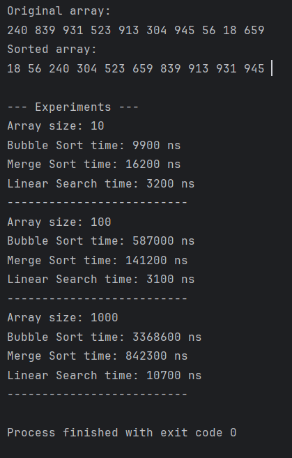

# Sorting and Searching Algorithm Analysis

## Project Overview
This project compares sorting and searching algorithms in Java.
The goal is to measure execution time and analyze performance.

## Algorithms

### Bubble Sort
Bubble Sort compares neighboring elements and swaps them.
Time Complexity: O(n²)

### Merge Sort
Merge Sort divides the array and merges it back.
Time Complexity: O(n log n)

### Linear Search
Linear Search checks elements one by one.
Time Complexity: O(n)

## Results

| Array Size | Bubble Sort | Merge Sort | Linear Search |
|-----------|------------|------------|----------------|
| 10        | 9900 ns    | 16200 ns   | 3200 ns        |
| 100       | 587000 ns  | 141200 ns  | 3100 ns        |
| 1000      | 3368600 ns | 842300 ns  | 10700 ns       |

## Analysis
Merge Sort is faster than Bubble Sort, especially for large arrays.
Bubble Sort becomes very slow as the array size increases.
Linear Search works fine but becomes slower for large data.

## Screenshots

 
## Reflection
I learned how sorting algorithms work and how performance changes with input size.
Merge Sort is more efficient than Bubble Sort.